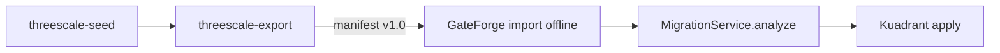

# AGENTS.md

Guidance for **all coding agents** (Cursor, Claude Code, Codex, etc.) in the **RHCL** program:
**3scale API Management → Connectivity Link (Kuadrant)** migration.

`CLAUDE.md` points here so Claude and other agents share the same view of the program.

## Language policy

**English only** for all agent-facing content:

- `AGENTS.md`, `CLAUDE.md`, Cursor rules (`.cursor/rules/`), and skills (`.cursor/skills/`)
- Architecture docs, workflows, and GitHub templates in `rhcl-ai`
- Code identifiers, comments, commit messages, PR descriptions, and GitHub issues

User-facing product READMEs in sibling repos must also be English — track via [rhcl-ai#3](https://github.com/Everything-is-Code/rhcl-ai/issues/3) and [3scaleextract#11](https://github.com/Everything-is-Code/3scaleextract/issues/11).

## Overview

| Repo | Stack | Role |
|------|-------|------|
| [3scaleextract](https://github.com/Everything-is-Code/3scaleextract) | Go 1.22 | Hybrid export, lab seed, visualize |
| [gateforge](https://github.com/Everything-is-Code/gateforge) | Java 17 / Quarkus, Angular 19 | Migration, Kuadrant apply/revert |
| **rhcl-ai** | Markdown, Cursor rules/skills | Cross-cutting docs, templates, AI guidelines |

## Follow these rules always

- `git` and `gh` commands are **approved** for agent automation.
- **Before handing back Go changes** (`3scaleextract`): run `go test ./...` and fix failures.
- **Before handing back Java changes** (`gateforge/backend`): run `mvn test` and fix failures.
- **Before handing back Angular changes** (`gateforge/frontend`): run `npm test` when relevant specs exist.
- **When creating a PR**: always use [templates/github/.github/pull_request_template.md](templates/github/.github/pull_request_template.md).
- **Never commit secrets**: 3scale tokens, kubeconfigs, OIDC client secrets, local `.env` files.
- **Export contract changes** (`schema_version`): update rhcl-ai + tests in 3scaleextract and gateforge.
- **Cursor**: configure workspace per [docs/ai/cursor-setup.md](docs/ai/cursor-setup.md) before coding.
- **Write in English** unless translating legacy Spanish content as part of an approved i18n issue.

### Git conventions

- **Never amend** after opening a PR. Commit forward; squash-on-merge handles final cleanup.
- Force-push only to **rebase onto an updated base**, not to rewrite review history.
- Tests ship **in the same PR** as code. Test-only PRs are only for refactoring existing tests.
- Branch names: `feature/EXT-1-description`, `fix/GF-3-ci-tests`, etc., from `main`.
- Commit messages: focus on **why**, not mechanical what.

### PR and review

- Reference issues (`EXT-*`, `GF-*`, `INT-*`, or GitHub `#number`).
- Address review comments (human or bot) or explain why not applicable.
- PO uses skill `pr-review-rhcl` — checklist in [.cursor/skills/pr-review-rhcl/SKILL.md](.cursor/skills/pr-review-rhcl/SKILL.md).

## External repositories / workspace layout

Recommended layout (open parent directory **`rhcl/`** in Cursor):

```
rhcl/
├── 3scaleextract/
├── gateforge/
├── rhcl-ai/          ← this repo (rules, skills, docs)
├── .cursor/          ← symlink or copy from rhcl-ai/.cursor
└── AGENTS.md         ← optional: symlink to rhcl-ai/AGENTS.md
```

Automated setup: [scripts/setup-rhcl-workspace.sh](scripts/setup-rhcl-workspace.sh)

## Architecture (summary)

Full docs: [docs/architecture/](docs/architecture/).



| Topic | Doc |
|-------|-----|
| Pipeline | [pipeline-overview.md](docs/architecture/pipeline-overview.md) |
| Export contract | [export-schema-v1.md](docs/architecture/export-schema-v1.md) |
| 3scale → CL mapping | [3scale-to-cl-mapping.md](docs/architecture/3scale-to-cl-mapping.md) |

### GateForge — key components

- `MigrationService` — analyze/apply, strategies `shared` / `dual` / `dedicated`
- `ThreeScaleService` — live Admin API + CRD discovery
- `ThreeScaleProduct` — target model; offline import (INT-2/3) maps from export v1
- Kuadrant resources: HTTPRoute, AuthPolicy, RateLimitPolicy, APIProduct, APIKey

### 3scaleextract — key components

- `internal/export` — hybrid Admin API + Red Hat toolbox export
- `internal/seed` — lab fixtures (`seed_api_key`, `seed_oidc`, …)
- `internal/visualize` — Markdown reports from on-disk export
- `output.SchemaVersion = "1.0"`

## Development commands

### RHCL workspace setup

```bash
git clone https://github.com/Everything-is-Code/rhcl-ai.git
./rhcl-ai/scripts/setup-rhcl-workspace.sh   # clones 3scaleextract + gateforge, syncs .cursor
```

### 3scaleextract

```bash
cd 3scaleextract
go test ./...
go test -tags=integration ./internal/export/...   # live tenant + THREESCALE_*
go build -o bin/threescale-export ./cmd/threescale-export
./scripts/demo/seed-and-export.sh                 # lab demo
```

### gateforge

```bash
cd gateforge/backend && mvn test
cd gateforge/backend && mvn quarkus:dev
cd gateforge/frontend && npm install && npm test && npm start
cp .env.example .env && ./scripts/local-up.sh     # Podman stack
```

### rhcl-ai

```bash
./scripts/sync-cursor-config.sh    # after git pull in rhcl-ai
```

## Code style

### Go (3scaleextract)

- Target module: `github.com/Everything-is-Code/3scaleextract`
- stdlib tests + HTTP mocks; no network in unit tests
- Explicit errors; do not silently swallow Admin API failures in critical seed/export paths

### Java (gateforge)

- Quarkus 3.x, Panache, Fabric8 K8s client
- JUnit 5 + Mockito for services
- Identifiers in English; logs via `LOG.infof`

### TypeScript (gateforge frontend)

- Angular 19, RxJS
- Jasmine/Karma tests; mock `ApiService` in components

## Testing philosophy

**Mock at the boundary, not the code under test.**

| Repo | Mock | Run for real |
|------|------|--------------|
| 3scaleextract seed | `admin.Client` HTTP | Seeder logic, fixtures |
| 3scaleextract export | Admin API + toolbox | `export.Service` orchestration |
| gateforge | `ThreeScaleService`, K8s client | `MigrationService.analyze()` |
| gateforge frontend | `HttpClient` / `ApiService` | Wizard components |

- Live tenant integration tests: `integration` tag (3scaleextract), not in default CI (EXT-3).
- GateForge **must** run `mvn test` in CI (GF-3) — Quay build currently uses `-DskipTests`.

## PO priorities

| Priority | Area |
|----------|------|
| P0 | GateForge tests (MigrationService, CI without skipTests) |
| P1 | Offline export → GateForge integration |
| P2 | E2E lab, visualize metrics, import UI |
| P3 | Hygiene (LICENSE, module path, templates, English docs) |

Milestones: **M1** Test foundation · **M2** Integration offline · **M3** E2E lab

## Cursor skills

| Skill | When |
|-------|------|
| `lab-pipeline-seed-export-migrate` | Lab, demos, E2E |
| `gateforge-migration` | MigrationService, kuadrantctl |
| `3scale-export-schema` | Export v1, parser, fixtures |
| `pr-review-rhcl` | PR review |

Setup: [docs/ai/cursor-setup.md](docs/ai/cursor-setup.md)

## Coder workflow

1. Pick issue with `area/*` label and milestone.
2. Branch from `main`.
3. PR with template; green tests.
4. PO review with `pr-review-rhcl`.

## External references

- [3scaleextract README](https://github.com/Everything-is-Code/3scaleextract)
- [gateforge README](https://github.com/Everything-is-Code/gateforge)
- Toolbox: `registry.redhat.io/3scale-amp2/toolbox-rhel9:3scale2.16`

## Adopted practices (reference)

Patterns inspired by mature agent-first projects (e.g. `lock_code_manager`):

- `AGENTS.md` as single source + thin `CLAUDE.md`
- Explicit agent operational rules (tests before handback, git conventions)
- Architecture and dev commands in the file agents consume
- Standardized GitHub templates + `blank_issues_enabled: false`

See [docs/ai/agent-governance.md](docs/ai/agent-governance.md) for RHCL-specific adoption details.
