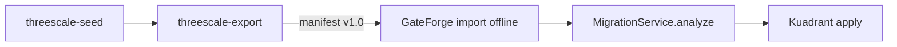

# AGENTS.md

Guidance for **all coding agents** (Cursor, Claude Code, Codex, etc.) in the **RHCL** program:
**3scale API Management → Connectivity Link (Kuadrant)** migration.

`CLAUDE.md` points here so Claude and other agents share the same view of the program.

## Language policy

**English only** for all agent-facing content:

- `AGENTS.md`, `CLAUDE.md`, Cursor rules (`.cursor/rules/`), and skills (`.cursor/skills/`)
- Architecture docs, workflows, and GitHub templates in `rhcl-ai`
- Code identifiers, comments, commit messages, PR descriptions, and GitHub issues

User-facing product READMEs in sibling repos must also be English — track via [3scaleextract#11](https://github.com/Everything-is-Code/3scaleextract/issues/11) and [gateforge#21](https://github.com/Everything-is-Code/gateforge/issues/21).

## Overview

| Repo | Stack | Role |
|------|-------|------|
| [3scaleextract](https://github.com/Everything-is-Code/3scaleextract) | Go 1.22 | Hybrid export, lab seed, visualize |
| [gateforge](https://github.com/Everything-is-Code/gateforge) | Java 17 / Quarkus, Angular 19 | Migration, Kuadrant apply/revert |
| **rhcl-ai** | Markdown, Cursor rules/skills | Cross-cutting docs, templates, AI guidelines |

## Follow these rules always

- `git` and `gh` commands are **approved** for agent automation.
- **Before handing back Go changes** (`3scaleextract`): run `go test ./...` and fix failures.
- **Before handing back Java changes** (`gateforge/backend`): run `mvn test` and fix failures.
- **Before handing back Angular changes** (`gateforge/frontend`): run `npm test` when relevant specs exist.
- **When creating a PR**: always use [templates/github/.github/pull_request_template.md](templates/github/.github/pull_request_template.md).
- **Never commit secrets**: 3scale tokens, kubeconfigs, OIDC client secrets, local `.env` files.
- **Export contract changes** (`schema_version`): update rhcl-ai + tests in 3scaleextract and gateforge.
- **Cursor workspace**: [docs/ai/cursor-setup.md](docs/ai/cursor-setup.md) · bootstrap [scripts/setup-rhcl-workspace.sh](scripts/setup-rhcl-workspace.sh)

### Git conventions

- **Commits** — run `git commit` only when the user explicitly asks in the current conversation. Edits and local prep (stash, rebase, checkout) are fine; do not commit to save progress.
- **Commit identity** — author and committer are always the user's local Git config (`user.name`, `user.email`); never run `git config` to change identity or hooks.
- **Never amend** after opening a PR. Commit forward; squash-on-merge handles final cleanup.
- Force-push only to **rebase onto an updated base**, not to rewrite review history.
- Tests ship **in the same PR** as code. Test-only PRs are only for refactoring existing tests.
- Default branch: **`main`** on all RHCL repos · protected (PR required, 1 approval, no force push; admins may bypass).
- Branch names: `feature/EXT-1-description`, `fix/GF-3-ci-tests`, etc., from `main`.
- Commit messages: focus on **why**, not mechanical what.

### PR and review

- Reference issues (`EXT-*`, `GF-*`, `INT-*`, or GitHub `#number`).
- Address review comments (human or bot) or explain why not applicable.
- PO uses skill `pr-review-rhcl` — checklist in [.cursor/skills/pr-review-rhcl/SKILL.md](.cursor/skills/pr-review-rhcl/SKILL.md).

## Workspace layout

Open parent directory **`rhcl/`** in Cursor (`3scaleextract/`, `gateforge/`, `rhcl-ai/`, `.cursor/` synced from rhcl-ai). Details: [docs/ai/cursor-setup.md](docs/ai/cursor-setup.md).

## Architecture (summary)

Full docs: [docs/architecture/](docs/architecture/).

| Topic | Doc |
|-------|-----|
| Pipeline | [pipeline-overview.md](docs/architecture/pipeline-overview.md) |
| Export contract | [export-schema-v1.md](docs/architecture/export-schema-v1.md) |
| 3scale → CL mapping | [3scale-to-cl-mapping.md](docs/architecture/3scale-to-cl-mapping.md) |

Key entry points: `MigrationService` / `ThreeScaleService` (gateforge) · `internal/export` / `internal/seed` (3scaleextract) · export `schema_version` **1.0**.

## Code style

Repo-specific rules in `.cursor/rules/` (`gateforge-java.mdc`, `3scaleextract-go.mdc`, `rhcl-global.mdc`). Per-stack conventions also in each repo README.

## Testing philosophy

**Mock at the boundary, not the code under test.**

| Repo | Mock | Run for real |
|------|------|--------------|
| 3scaleextract seed | `admin.Client` HTTP | Seeder logic, fixtures |
| 3scaleextract export | Admin API + toolbox | `export.Service` orchestration |
| gateforge | `ThreeScaleService`, K8s client | `MigrationService.analyze()` |
| gateforge frontend | `HttpClient` / `ApiService` | Wizard components |

- 3scaleextract integration tests: `integration` tag (EXT-3), not default CI.
- GateForge backend has minimal unit tests today (`PrerequisiteCatalogServiceTest`); **P0 (GF-1, GF-3)**: `MigrationService` coverage and CI without `-DskipTests`.

## PO priorities

| Priority | Area |
|----------|------|
| P0 | GateForge tests (MigrationService, CI without skipTests) |
| P1 | Offline export → GateForge integration |
| P2 | E2E lab, visualize metrics, import UI |
| P3 | Hygiene (LICENSE, module path, templates, English docs) |

Milestones: **M1** Test foundation · **M2** Integration offline · **M3** E2E lab

## Cursor skills

| Skill | When |
|-------|------|
| `lab-pipeline-seed-export-migrate` | Lab, demos, E2E |
| `gateforge-migration` | MigrationService, kuadrantctl |
| `3scale-export-schema` | Export v1, parser, fixtures |
| `pr-review-rhcl` | PR review |

## Coder workflow

1. Pick issue with `area/*` label and milestone.
2. Branch from `main`.
3. PR with template; green tests.
4. PO review with `pr-review-rhcl`.

## External references

- [3scaleextract README](https://github.com/Everything-is-Code/3scaleextract)
- [gateforge README](https://github.com/Everything-is-Code/gateforge)
- [Agent governance](docs/ai/agent-governance.md)
- Toolbox: `registry.redhat.io/3scale-amp2/toolbox-rhel9:3scale2.16`
