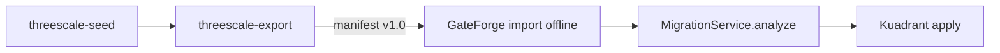

# AGENTS.md

Guía para **todos los agentes de código** (Cursor, Claude Code, Codex, etc.) en el programa
**RHCL**: migración **3scale API Management → Connectivity Link (Kuadrant)**.

`CLAUDE.md` apunta aquí para que Claude y otros agentes compartan la misma visión del programa.

## Overview

| Repo | Stack | Rol |
|------|-------|-----|
| [3scaleextract](https://github.com/Everything-is-Code/3scaleextract) | Go 1.22 | Export híbrido, seed lab, visualize |
| [gateforge](https://github.com/Everything-is-Code/gateforge) | Java 17 / Quarkus, Angular 19 | Migración, apply/revert Kuadrant |
| **rhcl-ai** | Markdown, Cursor rules/skills | Docs transversales, templates, lineamientos AI |

## Follow these rules always

- Los comandos `git` y `gh` están **aprobados** para automatización del agente.
- **Antes de entregar cambios en Go** (`3scaleextract`): ejecutar `go test ./...` y corregir fallos.
- **Antes de entregar cambios en Java** (`gateforge/backend`): ejecutar `mvn test` y corregir fallos.
- **Antes de entregar cambios en Angular** (`gateforge/frontend`): ejecutar `npm test` cuando existan specs relevantes.
- **Al crear un PR**: usar siempre [templates/github/.github/pull_request_template.md](templates/github/.github/pull_request_template.md).
- **No commitear secretos**: tokens 3scale, kubeconfigs, client secrets OIDC, `.env` locales.
- **Cambios de contrato export** (`schema_version`): actualizar rhcl-ai + tests en 3scaleextract y gateforge.
- **Cursor**: configurar workspace según [docs/ai/cursor-setup.md](docs/ai/cursor-setup.md) antes de codear.

### Git conventions

- **Nunca amend** después de abrir un PR. Commitear hacia adelante; squash-on-merge limpia al final.
- Force-push solo para **rebase sobre base actualizada**, no para reescribir historial de review.
- Tests van **en el mismo PR** que el código. PRs solo-test solo para refactor de tests existentes.
- Branch: `feature/EXT-1-descripcion`, `fix/GF-3-ci-tests`, etc., desde `main`.
- Mensajes de commit: foco en el **por qué**, no en el qué mecánico.

### PR y review

- Referenciar issue (`EXT-*`, `GF-*`, `INT-*` o `#número` de GitHub).
- Si hay comentarios de review (humano o bot): resolver o explicar por qué no aplica.
- PO usa skill `pr-review-rhcl` — ver checklist en [.cursor/skills/pr-review-rhcl/SKILL.md](.cursor/skills/pr-review-rhcl/SKILL.md).

## External repositories / workspace layout

Layout recomendado (directorio padre **`rhcl/`** abierto en Cursor):

```
rhcl/
├── 3scaleextract/
├── gateforge/
├── rhcl-ai/          ← este repo (rules, skills, docs)
├── .cursor/          ← symlink o copia desde rhcl-ai/.cursor
└── AGENTS.md         ← opcional: symlink a rhcl-ai/AGENTS.md
```

Setup automatizado: [scripts/setup-rhcl-workspace.sh](scripts/setup-rhcl-workspace.sh)

## Architecture (resumen)

Documentación completa en [docs/architecture/](docs/architecture/).



| Tema | Doc |
|------|-----|
| Pipeline | [pipeline-overview.md](docs/architecture/pipeline-overview.md) |
| Contrato export | [export-schema-v1.md](docs/architecture/export-schema-v1.md) |
| Mapping 3scale → CL | [3scale-to-cl-mapping.md](docs/architecture/3scale-to-cl-mapping.md) |

### GateForge — componentes clave

- `MigrationService` — analyze/apply, estrategias `shared` / `dual` / `dedicated`
- `ThreeScaleService` — discovery live Admin API + CRDs
- `ThreeScaleProduct` — modelo destino; import offline (INT-2/3) mapea desde export v1
- Recursos Kuadrant: HTTPRoute, AuthPolicy, RateLimitPolicy, APIProduct, APIKey

### 3scaleextract — componentes clave

- `internal/export` — export híbrido Admin API + toolbox Red Hat
- `internal/seed` — fixtures lab (`seed_api_key`, `seed_oidc`, …)
- `internal/visualize` — reportes Markdown desde export en disco
- `output.SchemaVersion = "1.0"`

## Development commands

### Setup workspace RHCL

```bash
git clone https://github.com/Everything-is-Code/rhcl-ai.git
./rhcl-ai/scripts/setup-rhcl-workspace.sh   # clona 3scaleextract + gateforge, sync .cursor
```

### 3scaleextract

```bash
cd 3scaleextract
go test ./...
go test -tags=integration ./internal/export/...   # tenant real + THREESCALE_*
go build -o bin/threescale-export ./cmd/threescale-export
./scripts/demo/seed-and-export.sh                 # lab demo
```

### gateforge

```bash
cd gateforge/backend && mvn test
cd gateforge/backend && mvn quarkus:dev
cd gateforge/frontend && npm install && npm test && npm start
cp .env.example .env && ./scripts/local-up.sh     # stack Podman
```

### rhcl-ai

```bash
./scripts/sync-cursor-config.sh    # tras git pull en rhcl-ai
```

## Code style

### Go (3scaleextract)

- Module objetivo: `github.com/Everything-is-Code/3scaleextract`
- Tests con stdlib + mocks HTTP; sin red en unit tests
- Errores explícitos; no silenciar fallos del Admin API en seed/export críticos

### Java (gateforge)

- Quarkus 3.x, Panache, Fabric8 K8s client
- JUnit 5 + Mockito para servicios
- Identificadores en inglés; logs con `LOG.infof`

### TypeScript (gateforge frontend)

- Angular 19, RxJS
- Tests con Jasmine/Karma; mockear `ApiService` en componentes

## Testing philosophy

**Mock en el límite, no el código bajo test.**

| Repo | Mock | Ejecutar de verdad |
|------|------|---------------------|
| 3scaleextract seed | `admin.Client` HTTP | Lógica seeder, fixtures |
| 3scaleextract export | Admin API + toolbox | Orquestación `export.Service` |
| gateforge | `ThreeScaleService`, K8s client | `MigrationService.analyze()` |
| gateforge frontend | `HttpClient` / `ApiService` | Componentes wizard |

- Integration tests con tenant real: tag `integration` (3scaleextract), no en CI por defecto (EXT-3).
- GateForge **debe** correr `mvn test` en CI (GF-3) — hoy usa `-DskipTests` en build Quay.

## Prioridades PO

| Prioridad | Área |
|-----------|------|
| P0 | Tests GateForge (MigrationService, CI sin skipTests) |
| P1 | Integración offline export → GateForge |
| P2 | E2E lab, visualize metrics, UI import |
| P3 | Hygiene (LICENSE, module path, templates) |

Milestones: **M1** Test foundation · **M2** Integration offline · **M3** E2E lab

## Skills Cursor

| Skill | Cuándo |
|-------|--------|
| `lab-pipeline-seed-export-migrate` | Lab, demos, E2E |
| `gateforge-migration` | MigrationService, kuadrantctl |
| `3scale-export-schema` | Export v1, parser, fixtures |
| `pr-review-rhcl` | Review de PRs |

Configuración: [docs/ai/cursor-setup.md](docs/ai/cursor-setup.md)

## Flujo de trabajo coder

1. Tomar issue con label `area/*` y milestone.
2. Branch desde `main`.
3. PR con template; tests verdes.
4. PO review con `pr-review-rhcl`.

## Referencias externas

- [3scaleextract README](https://github.com/Everything-is-Code/3scaleextract)
- [gateforge README](https://github.com/Everything-is-Code/gateforge)
- Toolbox: `registry.redhat.io/3scale-amp2/toolbox-rhel9:3scale2.16`

## Prácticas adoptadas (referencia)

Patrones inspirados en proyectos maduros de agent-first development (p. ej. `lock_code_manager`):

- `AGENTS.md` como fuente única + `CLAUDE.md` delgado
- Reglas operativas explícitas para agentes (tests antes de entregar, convenciones git)
- Arquitectura y comandos de dev en el mismo archivo que consume el agente
- Templates GitHub estandarizados + `blank_issues_enabled: false`

Ver [docs/ai/agent-governance.md](docs/ai/agent-governance.md) para detalle de qué aplicamos al programa RHCL.
