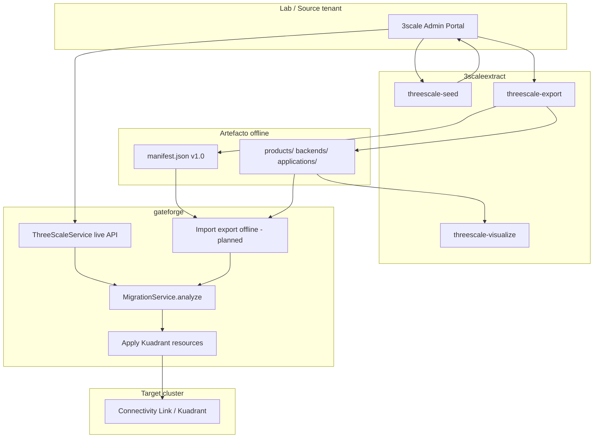

# Pipeline overview — RHCL

Programa de migración de **Red Hat 3scale API Management** a **Red Hat Connectivity Link** (Kuadrant en OpenShift).

## Diagrama

## Fases del producto GateForge

| Phase | Capacidad |
|-------|-----------|
| 1 | Multi-source 3scale Admin API |
| 2 | Multi-cluster target (ArgoCD discovery) |
| 3 | Hub-spoke persistence (PostgreSQL) |
| 4 | AI analysis (LangChain4j) |
| 5 | Developer Hub plugins |
| 6 | APICast discovery → Istio/CL mapping |

## Rol de cada repo

| Repo | Entrada | Salida |
|------|---------|--------|
| 3scaleextract | Credenciales Admin API | Directorio `export/` + Markdown report |
| gateforge | Productos 3scale (live o export) | YAML Kuadrant aplicado en cluster |
| rhcl-ai | — | Docs, skills, templates, contratos |

## Milestones PO

1. **M1** — Tests + CI en ambos repos
2. **M2** — Import offline export v1 en GateForge
3. **M3** — E2E lab automatizado (seed → export → analyze)
